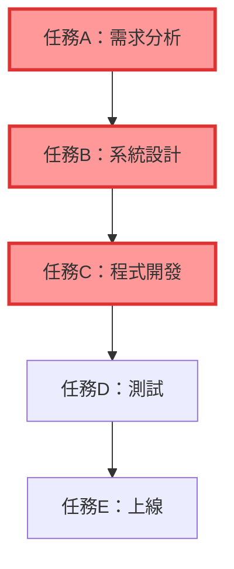
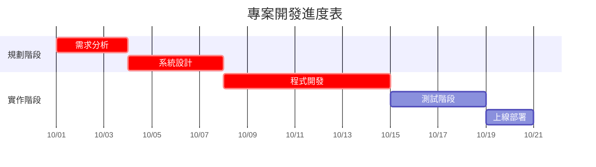

1. PERT / CPM 任務關係圖  
2. 甘特圖 (Gantt Chart)  
3. 關鍵路徑（Critical Path）以紅色顯示  

---

## 1.PERT / CPM 任務圖

```mermaid
graph TD
    A[任務A：需求分析] --> B[任務B：系統設計]
    B --> C[任務C：程式開發]
    C --> D[任務D：測試]
    D --> E[任務E：上線]
    
    class A,B,C critical
    classDef critical fill:#ff9999,stroke:#d33,stroke-width:3px;
```
## 2.甘特圖

```mermaid
gantt
    title 專案開發進度表
    dateFormat YYYY-MM-DD
    axisFormat %m/%d
    
    section 規劃階段
    需求分析 :crit, a1, 2025-10-01, 3d
    系統設計 :crit, a2, after a1, 4d
    
    section 實作階段
    程式開發 :crit, a3, after a2, 7d
    測試階段 :a4, after a3, 4d
    上線部署 :a5, after a4, 2d
```
## 3.關鍵路徑

```mermaid
graph LR
    A[需求分析] --> B[系統設計] --> C[程式開發] --> D[測試] --> E[上線]
    
    class A,B,C critical
    classDef critical fill:#ffcccc,stroke:#ff0000,stroke-width:3px;
```
